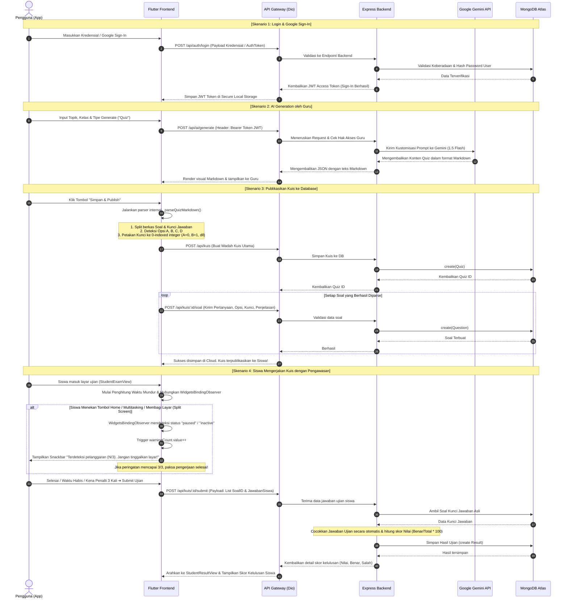

# Clevora: AI-Powered Proctored Educational Platform
> **UTS Capstone Collaboration - D-4 Teknik Informatika (Semester 6)**  
> *Fakultas Sekolah Vokasi*

Clevora adalah platform pendidikan digital pintar yang dirancang khusus untuk memfasilitasi guru dalam menyusun perangkat pembelajaran (Modul, Materi, ATP, dan Kuis) secara otomatis berbasis kecerdasan buatan (Generative AI) serta mengujinya kepada siswa secara aman dengan sistem pengawasan ujian digital (*intelligent proctoring system*).

---

## 🏛️ Kolaborasi 6 Mata Kuliah (Capstone Mapping)

Aplikasi Clevora dikembangkan sebagai wujud nyata integrasi dari 6 mata kuliah utama pada program studi D-4 Teknik Informatika:

### 1. Mobile Development
* **State Management & Routing**: Menggunakan framework **Flutter** dengan **GetX State Management** untuk manajemen *reactive state* (.obs) yang efisien, *routing* yang terpusat (`app_routes.dart` & `app_pages.dart`), serta pemisahan logika bisnis dari UI.
* **Layered Architecture**: Pembagian modul yang jelas yang terbagi atas:
  * **Views**: Refleksi komponen UI visual.
  * **Controllers**: Penghubung interaksi pengguna dan manipulasi data.
  * **Bindings**: Injeksi dependency secara malas (*lazy dependency injection*).
  * **Services / Providers**: Lapisan komunikasi jaringan dengan server backend.

### 2. Keamanan Data dan Jaringan (Security)
* **JWT Client Secure Handling**: Menyimpan JSON Web Token (JWT) yang diperoleh dari otentikasi login secara aman, dan menyisipkannya sebagai header otorisasi (`Bearer token`) pada setiap komunikasi data menggunakan Interceptor `Dio`.
* **Proctoring Anti-Cheating**: Memanfaatkan **WidgetsBindingObserver** untuk menangkap pergeseran status aplikasi (*AppLifecycleState*) secara *real-time*. Jika siswa mencoba keluar dari layar aplikasi, berganti ke split-screen, atau membuka panel notifikasi, sistem langsung mendeteksinya sebagai status `paused` / `inactive` dan menembakkan penalti peringatan (maksimal 3 kali sebelum ujian di-submit otomatis).

### 3. Web Service
* **RESTful Architecture**: Backend dikembangkan menggunakan **Node.js + Express** dengan desain endpoint RESTful yang ketat, penggunaan HTTP Methods (`GET` untuk *fetching*, `POST` untuk *creation*), serta HTTP Status Codes standard.
* **Role-Based Authentication**: Middleware backend memverifikasi signature JWT dan membatasi hak akses resource berdasarkan *role* pengguna (`roleMiddleware("guru")` vs `roleMiddleware("siswa")`).

### 4. Big Data
* **NoSQL Database**: Memanfaatkan **MongoDB Atlas** (cloud database) untuk penyimpanan data tidak terstruktur skala besar, seperti konten Modul Ajar AI, bank soal ujian, dan log hasil penilaian ujian siswa lengkap dengan detail performa pengerjaan per detik.

### 5. Penjaminan Mutu Perangkat Lunak (PMPL)
* **Testable Structure**: Kode dirancang secara modular dan *decoupled* agar mempermudah pelaksanaan pengujian unit (*Unit Testing*), pengujian widget (*Widget Testing*), serta pengujian integrasi *end-to-end*.

### 6. Pemrograman Sistem Cerdas 2 (Artificial Intelligence)
* **Generative AI Integration**: Mengintegrasikan model **Google Gemini 1.5 Flash** di tingkat backend untuk menghasilkan berkas pembelajaran (ATP, Modul Ajar, Materi Ajar, dan Kuis Ujian) secara instan berdasarkan topik, kelas, dan tingkat kesulitan yang dikustomisasi oleh guru.

---

## 📁 Struktur Folder Project

Aplikasi Clevora terbagi secara terpisah menjadi **Frontend (Flutter)** dan **Backend (Express)**.

### 1. Frontend Directory Layout (`c:\clevora`)
```
lib/
├── app/
│   ├── data/
│   │   ├── models/           # Mapping JSON Response dari API ke Objek Dart
│   │   │   ├── module_model.dart
│   │   │   ├── question_model.dart
│   │   │   ├── quiz_model.dart
│   │   │   └── user_model.dart
│   │   ├── providers/        # Konfigurasi Http Client (Dio) & Base URL
│   │   │   └── api_provider.dart
│   │   └── services/         # Penghubung langsung Flutter ke endpoint REST API
│   │       ├── auth_service.dart
│   │       ├── module_service.dart
│   │       └── quiz_service.dart
│   ├── modules/              # Modul fitur berbasis GetX (View - Controller - Binding)
│   │   ├── auth/             # Modul Login & Register
│   │   ├── student/          # Fitur Siswa (Daftar Kuis, Ujian Proctoring, Hasil)
│   │   │   ├── student_exam/
│   │   │   │   ├── controllers/student_exam_controller.dart # Logika Sensor Peringatan
│   │   │   │   └── views/student_exam_view.dart             # UI Proctoring & Ujian
│   │   │   ├── student_quiz/
│   │   │   └── student_result/
│   │   └── teacher/          # Fitur Guru (Dashboard, AI Generate, Quiz Management)
│   │       ├── ai_generate/
│   │       │   ├── controllers/ai_result_controller.dart    # Parser Kuis Markdown AI
│   │       │   └── views/ai_result_view.dart                # Visualisasi Render Markdown
│   │       ├── dashboard/
│   │       └── quiz_management/
│   ├── routes/               # Manajemen Routing & Navigasi Halaman
│   │   ├── app_pages.dart
│   │   └── app_routes.dart
│   └── theme/                # Palet Warna Utama (HSL Purple, Dark, Grey50)
│       └── app_theme.dart
└── main.dart                 # Entry point aplikasi Flutter & Inisialisasi Service Global
```

### 2. Backend Directory Layout (`c:\clevora-backend`)
```
src/
├── config/                   # Konfigurasi Koneksi Database (MongoDB Mongoose)
│   └── db.js
├── controllers/              # Logika Utama Handler Permintaan API
│   ├── aiController.js       # Komunikasi dengan Gemini API & Generator Prompts
│   ├── authController.js     # Otentikasi, JWT Sign-In, & Registrasi
│   ├── quizController.js     # CRUD Kuis & Auto-Grading (Penilaian Otomatis)
│   └── modulController.js
├── middleware/               # Keamanan (Auth Token Verification & Access Control)
│   ├── authMiddleware.js     # Verifikator signature JWT token
│   └── roleMiddleware.js     # Pembatas Hak Akses (Guru/Siswa)
├── models/                   # Definisi Skema Mongoose (MongoDB Collections)
│   ├── User.js
│   ├── Module.js
│   ├── Quiz.js
│   ├── Question.js
│   └── Result.js
├── routes/                   # Definisi Struktur Endpoint RESTful API
│   ├── auth.routes.js
│   ├── ai.routes.js
│   ├── kuis.routes.js
│   └── modul.routes.js
├── app.js                    # Inisialisasi Express, CORS, & Middleware Global
└── server.js                 # Entry point Server API Backend (Port 5000)
```

---

## 🔄 Alur Integrasi End-to-End (Frontend ➔ Backend)

Berikut adalah diagram alur interaksi terintegrasi antara aplikasi *Client* (Flutter) dan *Server* (Express Backend):



---

## 🚀 Cara Menjalankan Project

### 1. Menjalankan Backend API
1. Buka terminal di direktori backend:
   ```bash
   cd c:\clevora-backend
   ```
2. Pastikan file `.env` telah dikonfigurasi dengan benar:
   ```env
   PORT=5000
   MONGO_URI=mongodb+srv://... (Koneksi MongoDB Atlas Cloud)
   JWT_SECRET=... (Secret key token)
   GEMINI_API_KEY=... (API Key dari Google AI Studio)
   ```
3. Instal dependensi dan jalankan server dalam mode development:
   ```bash
   npm install
   npm run dev
   ```
4. Backend akan berjalan di: `http://localhost:5000`.

### 2. Menjalankan Frontend Flutter
1. Buka terminal baru di direktori frontend:
   ```bash
   cd c:\clevora
   ```
2. Pastikan emulator Android atau perangkat fisik telah terhubung.
3. Jalankan perintah instalasi paket dan jalankan aplikasi:
   ```bash
   flutter pub get
   flutter run
   ```
